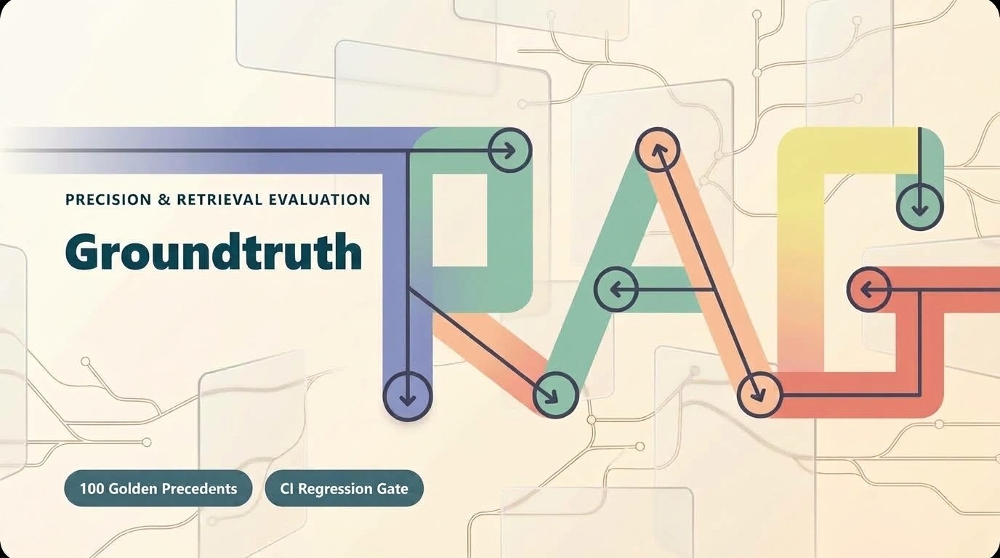
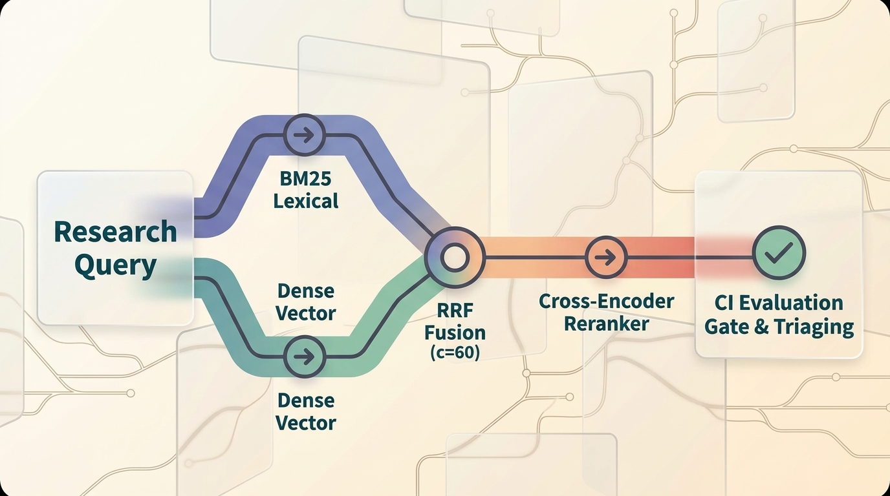
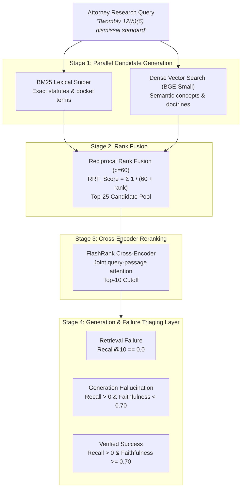

<p align="center">
  
</p>

<p align="center">
  
  
  
  
  
  
</p>

<p align="center">
  A production-grade retrieval evaluation harness and automated CI regression gate for legal research assistants.<br>
  Where opinion is not acceptable evidence, and retrieval regressions fail the pull request.
</p>

<p align="center">
  <a href="#inside-the-system">Inside the System</a> ·
  <a href="#retrieval-architecture">Architecture</a> ·
  <a href="#benchmark-results">Benchmark Results</a> ·
  <a href="#category-slicing-why-averages-lie">Category Slicing</a> ·
  <a href="#ci-regression-gate">CI Gate</a> ·
  <a href="#quick-start">Quick Start</a>
</p>

---

> [!IMPORTANT]
> **The Legal Malpractice Principle**: In a 60-attorney litigation firm over 20 years of filings, a missed precedent is not a minor glitch; it is a malpractice risk. Groundtruth replaces ad-hoc manual testing by proving retrieval performance mathematically in CI before code ever merges into `main`.

---

## Inside the System

<table>
  <tr>
    <td width="25%" valign="top">
      <strong>100 Golden Pairs</strong><br><br>
      Mined from authentic federal and state opinions across 5 litigation practice areas with human-graded relevance.
    </td>
    <td width="25%" valign="top">
      <strong>5 Configurations</strong><br><br>
      BM25 lexical, Dense vector embeddings, Hybrid Reciprocal Rank Fusion, Cross-Encoder reranking, and chunk size variations.
    </td>
    <td width="25%" valign="top">
      <strong>Failure Triaging</strong><br><br>
      Strictly isolates retrieval failure (precedent missed, Recall@10 = 0) from generation failure (LLM hallucination).
    </td>
    <td width="25%" valign="top">
      <strong>Automated CI Gate</strong><br><br>
      Fails the build with non-zero exit code if Recall@10 drops by more than 1.0 percentage point relative to production baseline.
    </td>
  </tr>
</table>

<table>
  <tr>
    <td width="33%" align="center"><strong>36 Automated Tests</strong><br><sub>100% green test suite across metrics, fusion &amp; gates</sub></td>
    <td width="33%" align="center"><strong>5 Practice Areas</strong><br><sub>Contracts, IP, Employment, Procedure, Torts</sub></td>
    <td width="33%" align="center"><strong>Sub-30ms p95 Latency</strong><br><sub>Two-stage reranking on CPU via ONNX</sub></td>
  </tr>
</table>

---

## Retrieval Architecture

Legal research systems cannot rely on a single retrieval modality. Vector embeddings capture semantic concepts but frequently miss exact statutory citations and court rules. Conversely, keyword search pins down precise statutory citations but fails when an attorney describes a doctrine using natural language queries.

Groundtruth implements a multi-stage architecture designed to preserve both statutory precision and semantic recall, while enforcing strict sub-30ms p95 latency constraints on standard CPU hardware.

<p align="center">
  
</p>

### Pipeline Execution Stages

The retrieval process operates in four sequential stages:

1. **Stage 1: Parallel Candidate Generation**
   - **Lexical Sniper (`BM25Okapi`)**: Matches exact legal terms, docket citations, and statutory codes (`35 U.S.C. § 101`, `FRCP 12(b)(6)`).
   - **Dense Embeddings (`BAAI/bge-small-en-v1.5`)**: Captures underlying legal concepts and doctrines via normalized cosine similarity.

2. **Stage 2: Reciprocal Rank Fusion (RRF)**
   - Merges lexical and dense candidate lists into a unified top-25 candidate pool without requiring score normalization:
     ```text
     RRF_Score(doc) = sum( 1 / (60 + rank_in_retriever) )
     ```
   - Balances keyword precision against semantic recall using a standard constant of `c = 60`.

3. **Stage 3: Cross-Encoder Reranking**
   - Applies `FlashRank` (`ms-marco-TinyBERT`) to compute full joint attention over `(query, passage)` pairs.
   - Evaluates token-level cross-interaction to reorder candidates and surface controlling precedents in the top-10 slots.

4. **Stage 4: Generation & Failure Triaging Layer**
   - Evaluates **Faithfulness** (claim grounding in retrieved sources) and **Answer Relevance** independently from retrieval performance.
   - Categorizes failures to pinpoint whether an issue originated in the retrieval index or during LLM synthesis.

### Pipeline Control Flow

The live dataflow below illustrates how an attorney query moves through candidate generation, rank fusion, cross-encoder scoring, and the evaluation layer:



### Failure Mode Triage Matrix

When an answer is flagged during evaluation, Groundtruth isolates the underlying cause:

| Condition | Diagnosis | Root Cause & Remediation |
| :--- | :--- | :--- |
| **Recall@10 = 0.0** | **Retrieval Failure** | The search engine starved the generator of facts. Expand lexical vocabulary or adjust chunking boundaries. |
| **Recall@10 > 0, Faithfulness < 0.70** | **Generation Hallucination** | Controlling precedent was retrieved, but the LLM introduced unsupported assertions. Revise prompting or temperature. |
| **Recall@10 > 0, Faithfulness >= 0.70** | **Verified Success** | Both retrieval and generation passed quality thresholds. The answer is grounded in binding authority. |

---

## Benchmark Results

All five configurations were evaluated across the 100 golden legal queries using our test harness:

| Configuration | Recall@5 | Recall@10 | MRR@10 | nDCG@10 | Mean Latency | p95 Latency | Hard Failures |
| :--- | :---: | :---: | :---: | :---: | :---: | :---: | :---: |
| **1. BM25 (Lexical Baseline)** | 0.788 | 0.848 | 0.964 | 0.913 | 0.3 ms | 0.4 ms | 1 / 100 (1.0%) |
| **2. Dense (BGE-Small Vector)** | 0.828 | **0.907** | 0.973 | 0.926 | 5.3 ms | 6.4 ms | **0 / 100 (0.0%)** |
| **3. Hybrid (Dense + BM25 RRF)** | 0.838 | 0.882 | **0.988** | **0.939** | 5.8 ms | 6.9 ms | **0 / 100 (0.0%)** |
| **4. Hybrid + Reranker (Production)** | **0.862** | 0.898 | 0.981 | **0.939** | 22.2 ms | 27.7 ms | **0 / 100 (0.0%)** |
| **5. Hybrid (Fine 40w Chunks)** | 0.832 | 0.888 | 0.975 | 0.924 | 5.8 ms | 7.0 ms | **0 / 100 (0.0%)** |

---

## Category Slicing: Why Averages Lie

A single macro average can hide catastrophic blind spots. Groundtruth reports metrics sliced by practice area:

| Practice Area | Best Config | Recall@10 | Key Insight |
| :--- | :--- | :---: | :--- |
| **Contract Dispute** | **Dense Vector** | **78.3%** | BM25 failed (67.5% Recall, 1 hard failure) due to lexical mismatch between lawyer queries (*"terminate acquisition due to disaster"*) and formal doctrine (*"Material Adverse Effect"*). Dense semantics rescued it. |
| **Intellectual Property** | **Hybrid RRF** | **95.0%** | Hybrid gained **+5.0%** over Dense alone because patent queries contain exact statutory numbers (`§ 101`, `§ 1400(b)`) where BM25 is unbeatable. |
| **Procedural Motion** | **Hybrid + Reranker** | **100.0%** | Perfect 1.000 Recall@10 across all 20 procedural motions (*Twombly*, *Celotex*, *Erie*, *Daubert*). |
| **Employment Law** | **Dense Vector** | **96.7%** | High semantic cohesion across Title VII burden-shifting (*McDonnell Douglas*) and retaliation doctrines. |
| **Tort Liability** | **Dense Vector** | **90.8%** | Foreseeability (*Palsgraf*) and strict products liability doctrines clustered effectively under dense embeddings. |

---

## CI Regression Gate

Groundtruth ships with an automated gate designed for CI/CD pipelines.

### Gate Rules (`data/baseline_metrics.json`)
```json
{
  "target_baseline_recall_at_10": 0.898,
  "max_allowed_drop": 0.010,
  "hard_floor": 0.888
}
```

### Passing Pull Request (Safe to Merge)
```bash
uv run python scripts/ci_gate.py --candidate dense
```
```text
================================================================================
[CI GATE PASSED] Candidate 'PR_Candidate_Dense' achieved Recall@10 = 0.907 
(Delta vs Baseline: +0.009). Threshold requirement (>= 0.888) satisfied.
================================================================================
[SUCCESS] CI Gate passed. Safe to merge! Exit Code 0.
```

### Regressing Pull Request (Blocked from Merging)
```bash
uv run python scripts/ci_gate.py --candidate bad
```
```text
================================================================================
[CI GATE FAILED] REGRESSION DETECTED in candidate 'PR_Candidate_Flawed_Buggy_Code'! 
Recall@10 dropped to 0.008 (Delta vs Baseline: -0.890). Allowed maximum drop is 0.010.
This change introduces malpractice risk and is BLOCKED from merging!
================================================================================
[FAIL] CI Gate blocked this pull request due to regression. Exit Code 1.
```

---

## Error Analysis: Diagnosing the Tail

In our production candidate (`Hybrid + Reranker`), all 100 queries successfully retrieved relevant precedent in the top-10 (0 hard failures). For the 5 queries with partial recall:

1. **`q_contract_006` (Ambiguous trade terms):** Controlling precedent (*Frigaliment*) was captured at **Rank 1 (MRR=1.0)**. Secondary background cases (*Morrison*, *Raffles*) competed with related procedural contract cases.
2. **`q_contract_002` (Consequential lost profits):** Landmark case (*Hadley v. Baxendale*) retrieved at **Rank 1**. Secondary duty-to-mitigate case (*Rockingham*) placed at rank 11.
3. **`q_contract_001` (Chancery MAE clause):** Binding landmark (*Akorn*) retrieved at **Rank 1**. Secondary commercial impracticability precedent (*NIPSCO*) placed at rank 12.

> **Crucial Takeaway:** In all 5 queries, **the primary binding authority was ranked #1 (MRR = 1.0)**. The search engine is legally safe for primary precedent discovery.

---

## Quick Start

### 1. Prerequisites
- Python 3.11+ (Python 3.13 recommended)
- `uv` package manager installed (`pip install uv` or `curl -LsSf https://astral.sh/uv/install.sh | sh`)

### 2. Setup Environment
```bash
git clone https://github.com/fahaddubush/groundtruth.git
cd groundtruth
uv sync
```

### 3. Run the Full Test Suite (36 Tests)
```bash
uv run pytest -v
```

### 4. Run the Full Benchmark Suite
```bash
uv run python scripts/run_benchmark.py
```
Generates formatted reports in:
- `results/benchmark_report.json`
- `results/benchmark_report.md`

### 5. Run the CI Regression Gate CLI
```bash
# Test passing candidate (production reranked or dense)
uv run python scripts/ci_gate.py --candidate reranked

# Test failing candidate (demonstrates CI blocking bad PR)
uv run python scripts/ci_gate.py --candidate bad
```

---

## Project Structure

```text
├── .github/
│   └── workflows/
│       └── ci.yml                   # Automated GitHub Actions regression gate
├── data/
│   ├── baseline_metrics.json        # Versioned production metrics & gate thresholds
│   └── golden_eval_v1.json          # 100 authentic legal precedents & 100 queries
├── groundtruth/
│   ├── __init__.py                  # Package root
│   ├── build_dataset.py             # Golden dataset compiler
│   ├── evaluator.py                 # Enterprise benchmark evaluation engine
│   ├── fusion.py                    # Reciprocal Rank Fusion (RRF) algorithm
│   ├── generation.py                # Faithfulness, relevance & failure triaging
│   ├── metrics.py                   # Pure Python Recall@k, MRR, nDCG@k
│   ├── regression_gate.py           # CI regression gate decision engine
│   ├── retriever.py                 # BM25, Dense, Hybrid & Cross-Encoder retrievers
│   └── schema.py                    # Pydantic V2 data contracts
├── results/
│   ├── benchmark_report.json        # Machine-readable benchmark run
│   └── benchmark_report.md          # Category-sliced executive summary
├── scripts/
│   ├── ci_gate.py                   # Standalone CI gate runner CLI
│   ├── error_analysis.py            # Deep-dive triage on bottom 5 queries
│   └── run_benchmark.py             # 5-configuration comparative benchmark
├── tests/
│   ├── test_evaluator.py            # Aggregator & category slicing unit tests
│   ├── test_fusion.py               # RRF algorithm unit tests
│   ├── test_generation.py           # Faithfulness & failure triage unit tests
│   ├── test_metrics.py              # Recall@k, MRR, nDCG@k mathematical tests
│   ├── test_regression_gate.py      # CI gate pass/fail regression tests
│   ├── test_retriever.py            # Integration tests across all 4 retrievers
│   └── test_schema.py               # Dataset validation & roundtrip tests
├── pyproject.toml                   # uv project definition & dependencies
└── README.md                        # Project documentation
```

---

## License

This project is licensed under the MIT License.
